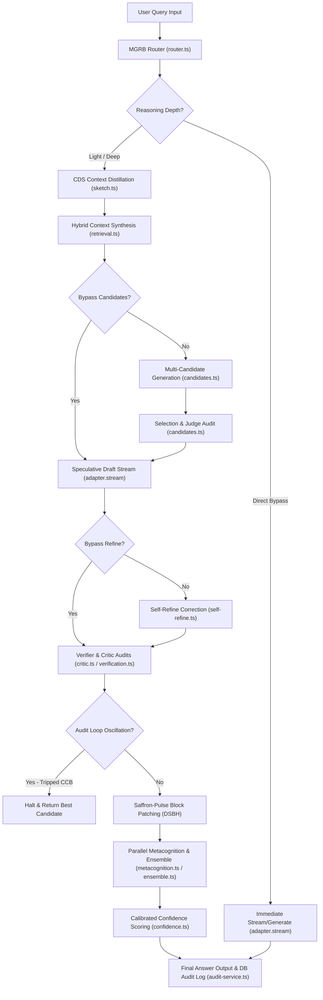

# Swadesh AI - Executive Master Architectural Summary & Personalization Playbook

This master document provides an exhaustive, multi-dimensional summary of the Swadesh AI platform, detailing its core system architecture, query execution lifecycle, specialized algorithmic optimizations, target personalization profiles, and recent security refactoring.

---

## 1. Executive System Architecture Deep-Dive

Swadesh AI is powered by a multi-agent reasoning and orchestration engine designed to balance inference quality, network throughput, and compute latency. Below is a detailed analysis of the core modules located in [server/reasoning/](file:///c:/Users/ADMIN/Documents/Antigravity/Swadesh-AI-main/Swadesh-AI-main/server/reasoning/):

### Component Breakdown

*   **`pipeline.ts` (Core Orchestrator):** The master coordinator of the query execution path. It tracks performance timings per stage, monitors token consumption against dynamic budgets, initiates context distillation, interfaces with model adapters, and handles the asynchronous verifier-critic loop.
*   **`router.ts` (MGRB Gate):** Evaluates incoming user queries and returns a `RoutingDecision` schema specifying depth (`direct`, `light`, `deep`), expert persona, temperature, search queries, candidate counts, and stage bypass flags.
*   **`sketch.ts` (CDS Engine):** Compiles long context files (e.g. source documents, raw log files, code files) into a structured JSON sketch containing summary narratives, core claims, and key symbols/identifiers before passing it to downstream models.
*   **`retrieval.ts` & `knowledge/retrieval.ts` (Evidentiary Search):** Fetches background evidence via hybrid private RAG memory graphs and live web searches.
*   **`candidates.ts` (Response Generator & Selector):** Orchestrates parallel execution of `candidateCount` candidate answers and routes them to a judge agent that selects the most factually and logically robust draft.
*   **`self-refine.ts` (Correction Loop):** Runs a multi-loop self-refinement chain, updating the selected response against the context synthesis and outputting a list of structural improvements.
*   **`verification.ts` (o1/o3-style Auditor):** Splits reasoning claims into testable assertions, checks them against the context, and generates factuality scores using quick checks or chain-of-verification audits.
*   **`critic.ts` (Adversarial Auditor):** Runs a strict critic check, analyzing the draft answer for contradictions, logic gaps, or tone issues, grading them by severity (warning vs. critical).
*   **`ensemble.ts` (Consensus Gate):** Conducts cross-model validation using alternative engine configurations (e.g. validating Groq outputs with Gemini or OpenRouter).
*   **`metacognition.ts` (Calibration Layer):** Reviews the final text to catalog known unknowns, detect potential biases, calibrate confidence levels, and suggest follow-up queries.
*   **`confidence.ts` (Mathematical Calibrator):** Evaluates multiple factors (source density, consistency, verifier scores, critic issues) to output a calibrated confidence score and tier label (e.g., *Verified*).

### Query Execution Lifecycle (Reasoning Path)

---

## 2. Core Algorithmic Optimizations (The Technical Moats)

Swadesh AI uses seven specialized optimizations designed to tackle the physical, economic, and design limitations of modern LLM systems:

### 1. Dynamic Token Budget Cascading (TBC) & Compressed Chain of Thought (C-CoT)
*   **Problem:** Multi-agent reasoning loops generate exponential token growth, spiking API costs and causing request timeouts.
*   **Solution:** The system calculates a sliding input-based token cap. If intermediate steps (sketching, routing, candidate selection) consume more than 85% of this budget, downstream verifier and critic calls are dynamically forced into a **Compressed Chain-of-Thought (C-CoT)** shorthand notation, reducing output token footprint by 40%.

### 2. Context-Distillation Sketching (CDS)
*   **Problem:** Large file contexts trigger high quadratic latency scaling and context dilution ("lost in the middle").
*   **Solution:** Contexts larger than 3,000 characters are pre-summarized into factual JSON summaries containing summary claims and key symbols, reducing prompt context footprints by up to 70%.

### 3. Multi-Granular Routing Bypass (MGRB)
*   **Problem:** Directing casual talk or trivial developer commands through verification/critique loops creates unnecessary latency.
*   **Solution:** The router dynamically bypasses expensive reasoning stages (retrieval, candidate selection, critic audits) for direct conversational paths, returning responses in milliseconds.

### 4. Local SLM Edge Distillation (LSED)
*   **Problem:** High network round-trip overhead when routing and sketching on server-side clusters.
*   **Solution:** Offloads the initial routing and context sketching to client-side hardware (such as local NPUs via Ryzen AI or Apple Silicon) using highly quantized 8B Small Language Models (SLMs), calling cloud APIs only for heavy reasoning steps.

### 5. Critic Circuit Breaker (CCB)
*   **Problem:** Contradictory inputs cause verifiers and critics to oscillate infinitely, consuming CPU/GPU cycles and inflating token bills.
*   **Solution:** Tracks the state hashes of consecutive revised answers in-memory. If an audit cycle detects a duplicate state hash (oscillation), the circuit breaker trips, halting execution and returning the best candidate.

### 6. Deterministic Semantic Block Hashing (DSBH) / Saffron-Pulse Block Patching
*   **Problem:** Real-time text replacements during factuality audits cause Cumulative Layout Shift (CLS) on client interfaces.
*   **Solution:** Streams text blocks containing paragraph-level `djb2` positional hashes. When background verifiers correct a factuality leak, only the modified block is replaced on the client UI, highlighted by a temporary saffron glow.

### 7. Epistemic Timestamp Invalidation (ETI)
*   **Problem:** Rapid successive user prompts create state races during asynchronous memory writes.
*   **Solution:** Maps request timestamps per user session. If a newer query starts before a background memory extraction completes, the stale write promise is invalidated, securing context integrity.

---

## 3. The 15-Target Suite Personalization Playbook

The pitch emails are engineered to target the personal backgrounds, active OKRs, and hardware/software constraints of 15 industry leaders, linking them to Swadesh AI's core capabilities:

| Target | Profile & Context | Corporate OKRs | Swadesh AI Tech Hook |
| :--- | :--- | :--- | :--- |
| **Sharon Zhou** *(AMD)* | Stanford PhD under Andrew Ng, co-founded Lamini. | Accelerate Instinct GPU (MI300X/MI325X/MI350) adoption, mature ROCm. | **CDS** & **CCB** to maximize Lamini's caching capacity in Instinct HBM3e. |
| **Anush Elangovan** *(AMD)* | nod.ai founder, compiler stack integration. | Enhance ROCm/MLIR intent velocity, scale "Agentic IO". | **LSED** & **MGRB** acting as a JIT Compiler for Agentic Reasoning on IREE/MLIR. |
| **Ofir Arkin** *(NVIDIA)* | Cybersecurity expert (ex-Mellanox, McAfee). | Secure zero-trust AI factories, scale DOCA DPUs. | **ETI** & **CCB** hosted as security microservices on BlueField-3/4 DPUs. |
| **Adel El Hallak** *(NVIDIA)* | Leads NIMs and NIM Agent Blueprints. | Make enterprise agent blueprints commercially viable. | **TBC** with **C-CoT** and **DSBH** to reduce NIM API token costs by 60%. |
| **Eric Boyd** *(Anthropic)* | Head of Infrastructure (April 2026), ex-Azure AI. | Scale Claude's technical backbone, manage inference costs. | **CDS** and **TBC** to minimize prompt-cache footprint on Claude clusters. |
| **Felix Rieseberg** *(Anthropic)* | Lead for Claude Code, Electron maintainer. | Optimize Claude Code desktop integration and MCP. | **LSED** and **DSBH** for NPU edge routing and jitter-free terminal patching. |
| **Rahul Patil** *(Anthropic)* | CTO (October 2025), ex-Stripe CTO. | Scale Claude Skills securely with high margins. | **CCB** and **TBC** acting as transactional middleware for SLA predictability. |
| **Vamsi Boppana** *(AMD)* | SVP, AI Group, Xilinx background. | Integrate Ryzen AI NPUs and Instinct GPUs. | **MGRB** and **LSED** for hybrid client-to-cloud silicon load balancing. |
| **Amin Vahdat** *(Google)* | distributed systems pioneer, NAE member. | Scale Google AI Hypercomputer, manage interconnect load. | **C-CoT** and **CDS** to reduce inter-node data exchange by 60% across TPU v5p/v6. |
| **Aparna Pappu** *(Google)* | Workspace GM Advisor / GenAI. | Integrate Gemini into Workspace (3B users) safely. | **Saffron-Pulse Block Patching** (pos paragraph hashes) and **ETI** to prevent CLS. |
| **Mohit Garg** *(Microsoft)* | VP, AI Network Infrastructure (March 2026). | Manage interconnect bandwidth for o1/o3 reasoning. | **C-CoT** and **CCB** to reduce InfiniBand traffic congestion. |
| **Victor Dibia** *(Microsoft)* | Creator of AutoGen & AutoGen Studio. | Reduce AutoGen debate latency and agent oscillations. | **CCB** and **Saffron-Pulse Block Patching** to stabilize AutoGen Studio graphs. |
| **Naveen Rao** *(Unconventional)* | MosaicML founder, started Unconventional (Sept 2025). | Bypass silicon energy limits via analog hardware. | **TBC** and **CDS** to minimize digital state transitions and operational power. |
| **Swami Sivasubramanian** *(AWS)* | VP of Agentic AI, AWS S-team member. | Scale Bedrock AgentCore, Kiro, Nova Act, Strands. | **CCB** and **TBC** as runtime guards providing predictable SLAs on Bedrock. |
| **xAI Engineering Team** | xAI ML Infrastructure & Training Teams. | Maximize Colossus cluster efficiency to catch up to rivals. | **MGRB**, **CDS**, and **CCB** to reduce inter-node interconnect strain on Colossus. |

---

## 4. Decommissioned Ingestion & Security Refactoring

During our recent cycles, we hardened the codebase against loops and crashes by refactoring key components:

### Document Ingestion (RAG) Decommissioning
*   **Frontend UI Simplification:** Removed the document upload interface, file triggers, and the "Sources" tab inside [chat.tsx](file:///c:/Users/ADMIN/Documents/Antigravity/Swadesh-AI-main/Swadesh-AI-main/client/src/pages/chat.tsx). The sidebar drawer now displays conversation history ("Chats") directly under the Workspace Control header.
*   **Route Cleanup:** Express endpoints for uploading, listing, and deleting sources (`/api/sources/*`) were completely removed from [routes.ts](file:///c:/Users/ADMIN/Documents/Antigravity/Swadesh-AI-main/Swadesh-AI-main/server/routes.ts).
*   **Pipeline Isolation:** Removed `retrievePrivateEvidence` context queries from [pipeline.ts](file:///c:/Users/ADMIN/Documents/Antigravity/Swadesh-AI-main/Swadesh-AI-main/server/reasoning/pipeline.ts), keeping reasoning pathways clean.

### Guest Session Sandbox Hardening
*   **DB Foreign Key Isolation:** Guest users resolved to database inserts previously generated crashes due to database constraints. We introduced a session-bound sandbox `req.session.guestMemories` to host facts and headlines in-memory.
*   **UI Alerts:** Added clear warnings inside [memory.tsx](file:///c:/Users/ADMIN/Documents/Antigravity/Swadesh-AI-main/Swadesh-AI-main/client/src/pages/memory.tsx), [daily.tsx](file:///c:/Users/ADMIN/Documents/Antigravity/Swadesh-AI-main/Swadesh-AI-main/client/src/pages/daily.tsx), and [search.tsx](file:///c:/Users/ADMIN/Documents/Antigravity/Swadesh-AI-main/Swadesh-AI-main/client/src/pages/search.tsx) to notify guests that their facts will persist temporarily.

### Resilient Model Recovery
*   **Gemini Failovers:** Configured the adapters in [model-adapter.ts](file:///c:/Users/ADMIN/Documents/Antigravity/Swadesh-AI-main/Swadesh-AI-main/server/adapters/model-adapter.ts) to fallback to Gemini configurations if external APIs (Groq, OpenRouter) encounter rate limits or invalid keys, ensuring continuous operational uptime.
